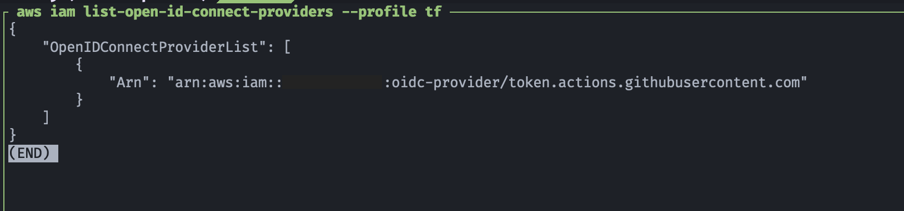

# 🛠️ Terraform - Bootstrap - Crea Proveedor de identidad OIDC de GitHub
[](#)
[](#)
[](#)

## 🎯 Objetivo (Target)
- Terraform crea el proveedor OIDC de GitHub en una cuenta AWS una única vez.
- Este proyecto es parte del flujo de GitOps en AWS. 
- Permite crear el recurso **`aws_iam_openid_connect_provider`** requerido por los roles de GitHub Actions.
- En todos los demás proyectos que creen roles IAM para GitHub Actions, no necesitan volver a crear el OIDC provider.
- Es posible reutilizar el ARN del OIDC en todos los módulos de GitHub Actions que creen roles IAM.
- Para usar el Provider OIDC solo se hace referencia al ARN usando el patrón:
    ```hcl
    Federated = "arn:aws:iam::<account_id>:oidc-provider/token.actions.githubusercontent.com"
    ```
---

## 🔍 Detalles importantes
- AWS no permite múltiples instancias del mismo **oidc-provider** por cuenta.
- El proveedor de OIDC de GitHub es global y compartido: [https://token.actions.githubusercontent.com](#)
- Lo recomendable es que ese proveedor se cree fuera de otros módulos de Terraform, una vez, como parte de la infraestructura base (bootstrap).

---

## 🔐 Thumbprint
- Ese parámetro utiliza el thumbprint oficial de GitHub
- Anteriormente era obligatorio, pero a partir de **12/julio/2024** AWS para la comunicación segura con OIDC identity providers (IdPs) usa una biblioteca de **root certificate authorities (CAs)** de confianza.
- Debido a lo anterior para los **OIDC identity providers (IdPs)** usados ampliamente como Git Hub, ya no es obligatorio especificar este parámetro.
- Este cambio es con la finalida de evitar tener que actualizar los **Thumbprint** de los certificados al rotar los certificados SSL/TLS de los **identity providers (IdPs)**
- La publicación de AWS con el aviso se localiza en la siguiente liga:
    - [AWS IAM simplifies management of OpenID Connect identity providers](https://aws.amazon.com/about-aws/whats-new/2024/07/aws-identity-access-management-open-id-connect-identity-providers/?utm_source=chatgpt.com)
- Terraform definió como opcional el parámetro **thumbprint_list** a partir de la **versión 5.81.0** de **AWS Provider** del **Resource: aws_iam_openid_connect_provider**
    - [Resource: aws_iam_openid_connect_provider](https://registry.terraform.io/providers/hashicorp/aws/5.81.0/docs/resources/iam_openid_connect_provider)
- Si se quiere especificar (no necesario) el **Thumbprint de Git Hub** se localiza en la siguiente liga:
    - [GitHub Actions – Update on OIDC integration with AWS](https://github.blog/changelog/2023-06-27-github-actions-update-on-oidc-integration-with-aws/)
    - En la configuración del OIDC la definición del thumbprint de Git Hub:
        ```hcl
        thumbprint_list = [
            "6938fd4d98bab03faadb97b34396831e3780aea1",
            "1c58a3a8518e8759bf075b76b750d4f2df264fcd"
        ]
        ```
- Como dato adicional se obtenía el **thumbprint** del certificado de Git Hub con los siguientes comandos:
    ```hcl 
    curl https://token.actions.githubusercontent.com/.well-known/openid-configuration
    ```

    ```hcl
    # Resultado del cURL:
    {"issuer":"https://token.actions.githubusercontent.com","jwks_uri":"https://token.actions.githubusercontent.com/.well-known/jwks","subject_types_supported":["public","pairwise"],"response_types_supported":["id_token"],"claims_supported":["sub","aud","exp","iat","iss","jti","nbf","ref","repository","repository_owner","run_id","run_number","run_attempt","actor","workflow","head_ref","base_ref","event_name","ref_type","environment","job_workflow_ref"],"id_token_signing_alg_values_supported":["RS256"],"scopes_supported":["openid"]}      
    ```

    ```hcl
    openssl s_client -servername token.actions.githubusercontent.com -showcerts -connect token.actions.githubusercontent.com:443
    ```

    ```hcl
    # Certificado Global Root CA:
    CONNECTED(00000005)
    ...
    1 s:/C=US/O=DigiCert Inc/CN=DigiCert TLS RSA SHA256 2020 CA1
    i:/C=US/O=DigiCert Inc/OU=www.digicert.com/CN=DigiCert Global Root CA
    -----BEGIN CERTIFICATE-----
    MIIE6jCCA9KgAwIBAgIQCjUI1VwpKwF9+K1lwA/35DANBgkqhkiG9w0BAQsFADBh
    MQswCQYDVQQGEwJVUzEVMBMGA1UEChMMRGlnaUNlcnQgSW5jMRkwFwYDVQQLExB3
    d3cuZGlnaWNlcnQuY29tMSAwHgYDVQQDExdEaWdpQ2VydCBHbG9iYWwgUm9vdCBD
    QTAeFw0yMDA5MjQwMDAwMDBaFw0zMDA5MjMyMzU5NTlaME8xCzAJBgNVBAYTAlVT
    MRUwEwYDVQQKEwxEaWdpQ2VydCBJbmMxKTAnBgNVBAMTIERpZ2lDZXJ0IFRMUyBS
    U0EgU0hBMjU2IDIwMjAgQ0ExMIIBIjANBgkqhkiG9w0BAQEFAAOCAQ8AMIIBCgKC
    AQEAwUuzZUdwvN1PWNvsnO3DZuUfMRNUrUpmRh8sCuxkB+Uu3Ny5CiDt3+PE0J6a
    qXodgojlEVbbHp9YwlHnLDQNLtKS4VbL8Xlfs7uHyiUDe5pSQWYQYE9XE0nw6Ddn
    g9/n00tnTCJRpt8OmRDtV1F0JuJ9x8piLhMbfyOIJVNvwTRYAIuE//i+p1hJInuW
    raKImxW8oHzf6VGo1bDtN+I2tIJLYrVJmuzHZ9bjPvXj1hJeRPG/cUJ9WIQDgLGB
    Afr5yjK7tI4nhyfFK3TUqNaX3sNk+crOU6JWvHgXjkkDKa77SU+kFbnO8lwZV21r
    eacroicgE7XQPUDTITAHk+qZ9QIDAQABo4IBrjCCAaowHQYDVR0OBBYEFLdrouqo
    qoSMeeq02g+YssWVdrn0MB8GA1UdIwQYMBaAFAPeUDVW0Uy7ZvCj4hsbw5eyPdFV
    MA4GA1UdDwEB/wQEAwIBhjAdBgNVHSUEFjAUBggrBgEFBQcDAQYIKwYBBQUHAwIw
    EgYDVR0TAQH/BAgwBgEB/wIBADB2BggrBgEFBQcBAQRqMGgwJAYIKwYBBQUHMAGG
    GGh0dHA6Ly9vY3NwLmRpZ2ljZXJ0LmNvbTBABggrBgEFBQcwAoY0aHR0cDovL2Nh
    Y2VydHMuZGlnaWNlcnQuY29tL0RpZ2lDZXJ0R2xvYmFsUm9vdENBLmNydDB7BgNV
    HR8EdDByMDegNaAzhjFodHRwOi8vY3JsMy5kaWdpY2VydC5jb20vRGlnaUNlcnRH
    bG9iYWxSb290Q0EuY3JsMDegNaAzhjFodHRwOi8vY3JsNC5kaWdpY2VydC5jb20v
    RGlnaUNlcnRHbG9iYWxSb290Q0EuY3JsMDAGA1UdIAQpMCcwBwYFZ4EMAQEwCAYG
    Z4EMAQIBMAgGBmeBDAECAjAIBgZngQwBAgMwDQYJKoZIhvcNAQELBQADggEBAHer
    t3onPa679n/gWlbJhKrKW3EX3SJH/E6f7tDBpATho+vFScH90cnfjK+URSxGKqNj
    OSD5nkoklEHIqdninFQFBstcHL4AGw+oWv8Zu2XHFq8hVt1hBcnpj5h232sb0HIM
    ULkwKXq/YFkQZhM6LawVEWwtIwwCPgU7/uWhnOKK24fXSuhe50gG66sSmvKvhMNb
    g0qZgYOrAKHKCjxMoiWJKiKnpPMzTFuMLhoClw+dj20tlQj7T9rxkTgl4ZxuYRiH
    as6xuwAwapu3r9rxxZf+ingkquqTgLozZXq8oXfpf2kUCwA/d5KxTVtzhwoT0JzI
    8ks5T1KESaZMkE4f97Q=
    -----END CERTIFICATE-----
    ...
    ```

    ```hcl
    # Guardar root certificate como cert.crt
    openssl x509 -in cert.crt -fingerprint -noout | sed -e 's/://g'
    SHA1 Fingerprint=6938FD4D98BAB03FAADB97B34396831E3780AEA1
    
    openssl x509 -in cert.crt -fingerprint -noout | sed -e 's/://g' | tr '[:upper:]' '[:lower:]'
    sha1 fingerprint=6938fd4d98bab03faadb97b34396831e3780aea1
    ```

    ```hcl
    # Descripción del comando:
    # Se conecta al servidor de GitHub OIDC
    # Extrae el certificado raíz
    # Calcula su hash SHA-1
    # Devuelve el fingerprint sin : (que es lo que AWS espera)

    openssl s_client -servername token.actions.githubusercontent.com -showcerts -connect token.actions.githubusercontent.com:443 </dev/null 2>/dev/null \
        | openssl x509 -fingerprint -noout -sha1 \
        | sed 's/://g' \
        | sed 's/SHA1 Fingerprint=//'

    ```

---

## 💡 Ventajas de separar el bootstrap
| Beneficio                                   | Descripción                                                 |
|---------------------------------------------|-------------------------------------------------------------|
| Seguridad                                   | Evita errores de creación múltiple del mismo proveedor OIDC |
| Reutilización                               | Otros módulos solo crean roles, no duplican OIDC            |
| Modularidad y mantenimiento claro           | Bootstrap se mantiene separado de otros pipelines GitOps    |
| Escalabilidad                               | Añadir aquí S3 state backend, roles base, políticas comunes etc. |

---

## 📋 Requisitos
- Terraform >= 1.11.0
- Terraform AWS Provider >= 5.81.0
- AWS CLI configurado
- Permisos para crear recursos IAM

---

## 🔀 Alternativa
- Es posible crear el Provider OIDC usando AWS CLI
    ```bash
    aws iam create-open-id-connect-provider \
        --url https://token.actions.githubusercontent.com \
        --client-id-list sts.amazonaws.com \
        --thumbprint-list 6938fd4d98bab03faadb97b34396831e3780aea1 # Para OIDC de Github no es necesario
    ```

 ## 🚀 Resultado (Outcome)
 ### Listar el OIDC creado
 - Comando de AWS CLI
    ```hcl
    aws iam list-open-id-connect-providers --profile tf
    ```

<p align="center">
    
</p>

---

## 📚 Referencias
- [OIDC federation](https://docs.aws.amazon.com/IAM/latest/UserGuide/id_roles_providers_oidc.html)
- [Obtain the thumbprint for an OpenID Connect identity provider](https://docs.aws.amazon.com/IAM/latest/UserGuide/id_roles_providers_create_oidc_verify-thumbprint.html)
- [About security hardening with OpenID Connect](https://docs.github.com/en/actions/security-for-github-actions/security-hardening-your-deployments/about-security-hardening-with-openid-connect)
- [GitHub Actions and OIDC Update for Terraform and AWS](https://colinbarker.me.uk/blog/2025-01-12-github-actions-oidc-update/)
- [create-open-id-connect-provider](https://docs.aws.amazon.com/cli/latest/reference/iam/create-open-id-connect-provider.html)
- [AWS IAM simplifies management of OpenID Connect identity providers](https://aws.amazon.com/about-aws/whats-new/2024/07/aws-identity-access-management-open-id-connect-identity-providers/?utm_source=chatgpt.com)
 - [GitHub Actions – Update on OIDC integration with AWS](https://github.blog/changelog/2023-06-27-github-actions-update-on-oidc-integration-with-aws/)
 - [GitHub Actions – OIDC integration with AWS no longer requires pinning of intermediate TLS certificates](https://github.blog/changelog/2023-07-13-github-actions-oidc-integration-with-aws-no-longer-requires-pinning-of-intermediate-tls-certificates/)

---