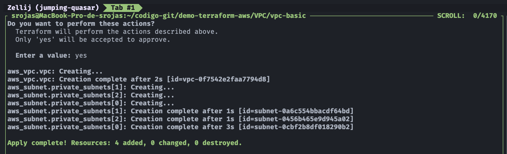
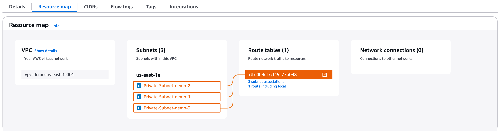

## 🛠️ Demo: VPC (Virtual Private Cloud)

## 🎯 Objetivo (Target)
Este ejemplo provisiona con siguientes recursos:
- 1 VPC 
- 3 Subnets

---

## 🚀 Resultado (Outcome)
### Terraform apply

### Resource map (Private Subnets)

---