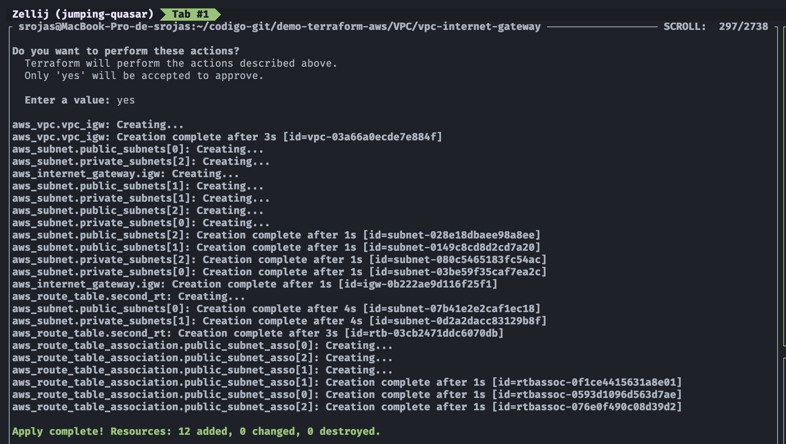
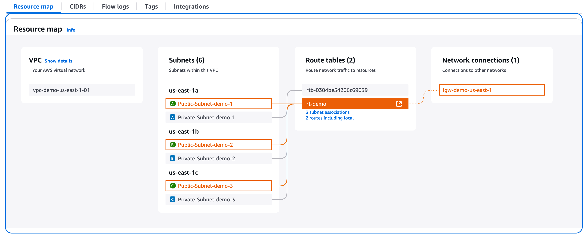

## 🛠️ Demo: VPC (Virtual Private Cloud) con Internet Gateway

## 🎯 Objetivo (Target)
Este ejemplo provisiona una VPC con los siguientes componentes:
- 1 **`Internet Gateway`**
- 3 **`Public Subnets`**, una en cada AZ
- 3 **`Private Subnets`**, una en cada AZ
- Configuración de **`Route Table`** (principal y adicional)

---

## 🚀 Resultado (Outcome)
### Terraform apply

### Resource map (Public Subnets)

### Resource map (Private Subnets)

---