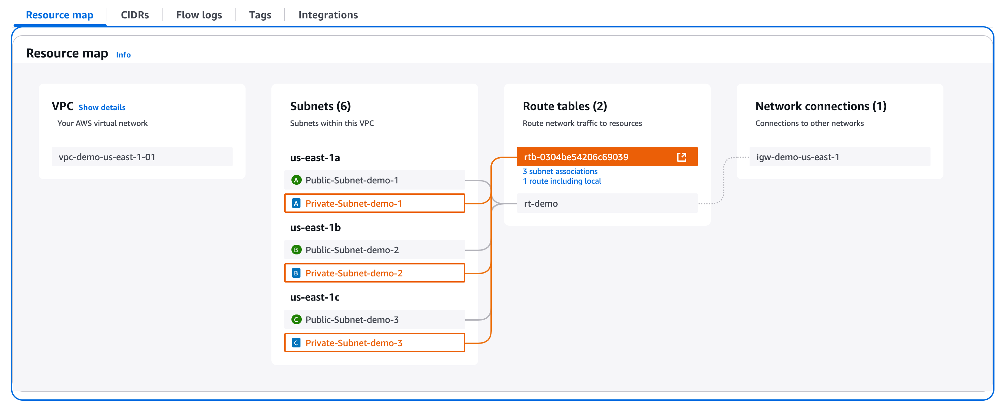

## Demo: VPC (Virtual Private Cloud)

## Objetivo
Este ejemplo provisiona una VPC con los siguientes componentes:
- 1 **`Internet Gateway`**
- 3 **`Public Subnets`**, una en cada AZ
- 3 **`Private Subnets`**, una en cada AZ
- Configuración de **`Route Table`** (principal y adicional)
---

## Resultado (Outcome)

