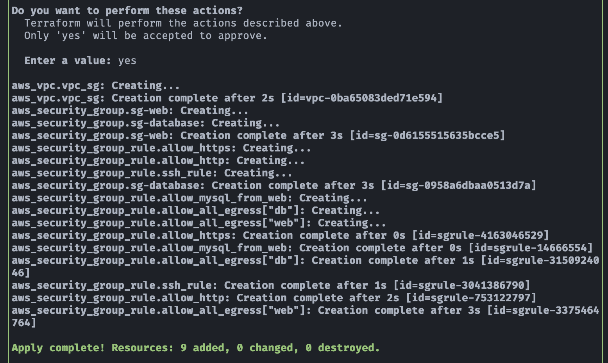
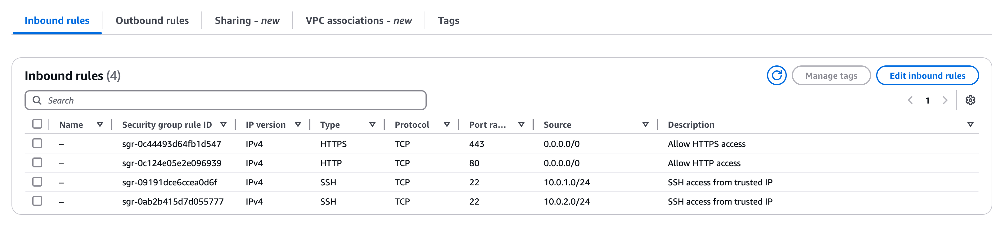
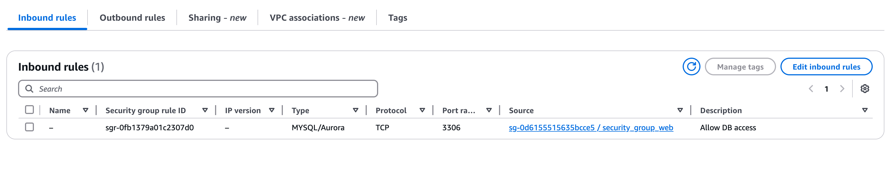
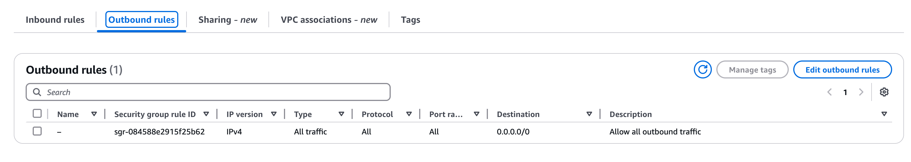

## 🛠️ Demo: VPC (Virtual Private Cloud) con Security Groups

## 🎯 Objetivo (Target)
Este ejemplo provisiona una VPC con los siguientes componentes:
- 2 **`Security Groups`**
- Uno de los security groups aplica control de acceso basado en la referencia de un SG en lugar de direcciones IP estáticas.

---

## 🚀 Resultado (Outcome)
### Terraform apply

### security_group_web (Inbound rules)

### security_group_database (Inbound rules)

### Outbound rule

---