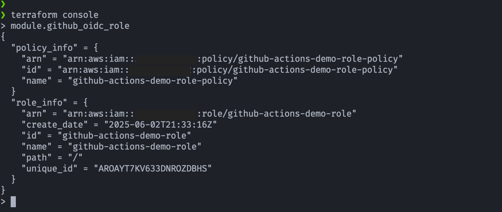

## 🛠️ Ejemplo de uso de módulo OIDC-rol con asignación de Política

[](#)
[](#)
[](#)

## 🎯 Objetivo (Target)
- Ejemplo del uso del módulo Terraform para crear un rol de AWS IAM con soporte para autenticación OIDC desde GitHub Actions.
- Incluye la **trust policy** para GitHub como proveedor de identidad y permite definir una política de permisos personalizada.
- El uso del módulo facilita la configuración segura del acceso federado desde **workflows de GitHub** a recursos de AWS.

---

## 🧱 Recursos creados
Este módulo crea los siguientes recursos de AWS:
- Rol AWS IAM para GitHub Actions con OIDC y permisos mínimos.
- Política que aplica al Rol.
- **aws_iam_role**: Rol IAM con una trust policy configurada para el proveedor de identidad OIDC de GitHub (`token.actions.githubusercontent.com`). Permite que workflows específicos de GitHub Actions asuman el rol.
- **aws_iam_policy**: Política IAM personalizada con los permisos necesarios para que el rol pueda acceder a recursos de AWS. La política puede ser definida por el usuario del módulo.
- **aws_iam_role_policy_attachment**: Asocia la política IAM creada (o una existente) con el rol IAM generado, permitiendo aplicar permisos.
- Opcionalmente, si no se define una política personalizada, el módulo puede permitir usar ARNs de políticas existentes.

## 🚀 Resultado (Outcome)
### Terraform console
- Para ver directamente los outputs del módulo (sin exponerlos)
    
    ```bash
    terraform console
    > module.github_oidc_role
    > module.github_oidc_role.role_info
    > module.github_oidc_role.policy_info
    ```

- Ejecución de terraform console

    <p align="center">
    
    </p>

---

## 📚 Referencias
[Terraform - Bootstrap - Crea Proveedor de identidad OIDC de GitHub](https://github.com/samuelrojasm/demo-terraform-aws/tree/main/IAM/iam-openid-connect-github)

---