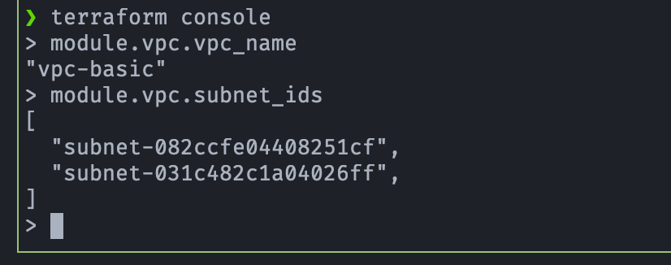
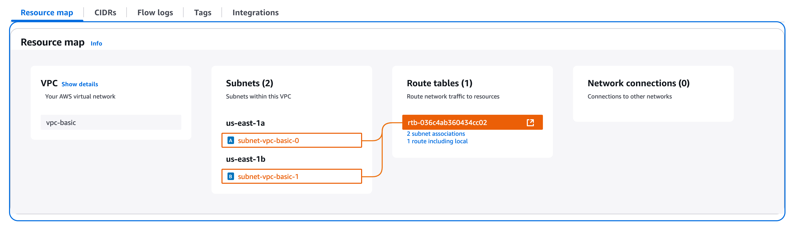

## 🛠️ Terraform AWS VPC Module

[](#)
[](#)
[](#)

## 🎯 Objetivo (Target)
Este módulo crea una VPC sencilla en AWS con:
- CIDR por defecto `10.0.0.0/16`
- 2 subnets `10.0.1.0/24` `10.0.2.0/24`
- Zonas `us-east-1a` y `us-east-1b`
- Soporte DNS habilitado

---

## ⚡️ Uso rápido

```hcl
module "vpc" {
  source = "../../modules/vpc/vpc-basic"
}
```

---

##  📄 Uso con archivo terraform.tfvars
- Es posible definir todas las variables en un archivo `terraform.tfvars` para personalizar sin modificar el código del módulo:

  -  Declarar el módulo en el root (en el main.tf del módulo raíz)

      ```hcl
      module "vpc" {
        source    = "../../modules/vpc/vpc-basic"
        vpc_name  = var.vpc_name  # <- pasar la variable
        vpc_cidr           = var.vpc_cidr
        subnets            = var.subnets
        availability_zones = var.availability_zones
        tags               = var.tags
      }
      ```

  - Definir la variable en el root (variables.tf)

      ```hcl
      variable "vpc_name" {
          type        = string
          description = "Nombre de la VPC que se pasa al módulo"
      }

      variable "vpc_cidr" {
        type = string
      }

      variable "subnets" {
        type = list(string)
      }

      variable "availability_zones" {
        type = list(string)
      }

      variable "tags" {
        type = map(string)
      }
      ```

  - Sobrescribir valor en terraform.tfvars

      ```hcl
      # terraform.tfvars
      name               = "custom-vpc"
      vpc_cidr           = "10.1.0.0/16"
      subnets            = ["10.1.1.0/24", "10.1.2.0/24"]
      availability_zones = ["us-east-1a", "us-east-1b"]
      
      tags = {
        Environment = "dev"
        Owner       = "network-team"
      }
      ```

- Terraform detectará este archivo automáticamente:

  ```bash
  terraform init
  terraform apply
  ```

- También se puede usar otro nombre para el archivo de variables:

  ```bash
  terraform apply -var-file="custom-values.tfvars"
  ```

---

## 🚀 Outputs
### Valores definidos
- Definidas en el módulo
  - `vpc_id`: ID de la VPC
  - `vpc_name`: Tag con el nombre de la VPC
  - `subnet_ids`: IDs de subnets

### Usar terraform console
-  Para ver directamente los outputs del módulo (sin exponerlos)

    ```bash
    terraform console
    > module.vpc.vpc_name
    > module.vpc.vpc_id
    > module.vpc.subnet_ids
    ```

- Ejecución de terraform console

    <p align="center">
    
    </p>

### Resource map (VPC y Subnets)

<p align="center">

</p>

##  🔧 Variables
- Es posible sobrescribir cualquier variable si es necesario. 
  - Consultar **`variables.tf`**

## ✅ Requisitos
- AWS provider configurado
- Terraform >= 1.0

---

## 📚 Referencias

- [What is Amazon VPC?](https://docs.aws.amazon.com/vpc/latest/userguide/what-is-amazon-vpc.html)
- [Amazon Virtual Private Cloud](https://aws.amazon.com/vpc/)

---