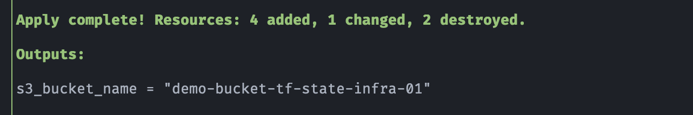
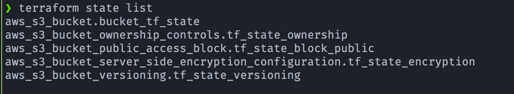
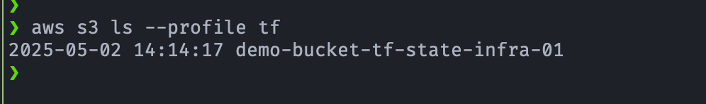
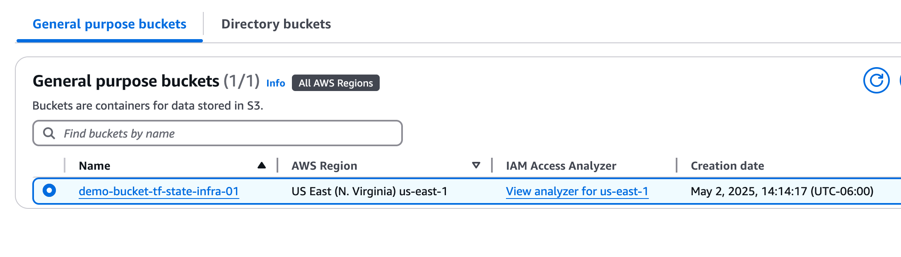

## 🛠️ Demo: Amazon S3 - Bucket para guardar estado de Terraform

## 🎯 Objetivo (Target)
- Establecer de forma segura y reutilizable el almacenamiento del estado remoto de Terraform en AWS, como paso previo a cualquier proyecto de infraestructura que dependa de este backend.

## 🧱 Recursos creados
- Crear la infraestructura inicial necesaria para almacenar el estado remoto (backend) de Terraform en AWS, incluyendo:
    - Un bucket S3 (almacenar el archivo **`terraform.tfstate`**)
    - Habilita versionado
    - Habilita cifrado
    - Bloquea el uso de ACLs (BucketOwnerEnforced)

## 🚀 Resultado (Outcome)
### Terraform apply
- El output incluirá el nombre del **S3 Bucket** para configurar el backend remoto en otros proyectos.

### Terraform state list

### Lista el Bucket creado en S3 con AWS CLI
 

    
    

### Lista Bucket en la consola 
 

    
    

---

## 📚 Referencias
- [Resource: aws_s3_bucket](https://registry.terraform.io/providers/hashicorp/aws/latest/docs/resources/s3_bucket)
- [Resource: aws_s3_bucket_versioning](https://registry.terraform.io/providers/hashicorp/aws/latest/docs/resources/s3_bucket_versioning)
- [Resource: aws_s3_bucket_server_side_encryption_configuration](https://registry.terraform.io/providers/hashicorp/aws/latest/docs/resources/s3_bucket_server_side_encryption_configuration)
- [Resource: aws_s3_bucket_public_access_block](https://registry.terraform.io/providers/hashicorp/aws/latest/docs/resources/s3_bucket_public_access_block)

---