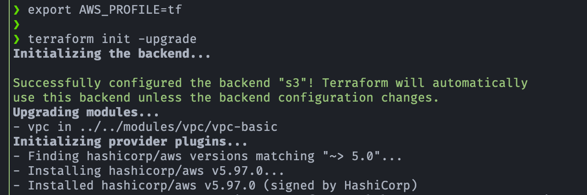
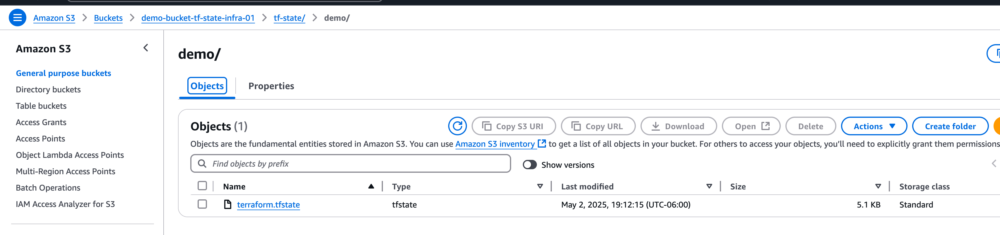

## 🛠️ Demo: Amazon S3 - Almacenar estado de Terraform en un Bucket

[](#)
[](#)
[](#)

## 🎯 Objetivo (Target)
- Demostrar cómo almacenar el estado de Terraform de forma remota utilizando un bucket de Amazon S3, haciendo uso del bloque **`backend`** en la configuración de Terraform. 
- Almacena el archivo de estado en un servicio remoto en Amazon S3, lo que garantiza un acceso centralizado y una mejor colaboración.
- Adoptar un backend remoto como Amazon S3 es un paso crucial para construir una infraestructura resiliente y escalable con Terraform.
- Esta práctica permite una mejor gestión del estado en entornos colaborativos y asegura la persistencia y consistencia del estado de la infraestructura.

---

## 💡 Motivo
- Terraform almacena por defecto el estado de la infraestructura en un archivo local (`terraform.tfstate`). Esto puede ser problemático cuando múltiples personas trabajan en el mismo proyecto o cuando se desea centralizar y asegurar este archivo. Utilizar un backend remoto como Amazon S3:
    - Previene conflictos en el archivo de estado.
    - Facilita el trabajo en equipo.
    - Permite versionado, auditoría y recuperación ante fallos.
    - Es un paso inicial hacia la automatización y el control de cambios en infraestructura como código.

---

## ✅ Prerequisitos
- Para usar la función de **backend state** es necesario tener listo los siguientes recursos:
    - Bucket de Amazon S3 para almacenar el estado de Terraform

---

## 🚀 Resultado (Outcome)
### Terraform init 
- El **backend** de Terraform se configura antes que cualquier proveedor. 
- Terraform necesita autenticarse para poder acceder al estado remoto en S3.
- Debido a esto cualquier proyecto donde uses backend "s3" y AWS SSO, se debe exportar el perfil antes de ejecutar **terraform init**, aunque se tenga el profile configurado en el **provider**.
- En este contexto no lee el **bloque provider**, ni tampoco detecta automáticamente el perfil SSO a menos que lo exportes con:

    ```bash
    export AWS_PROFILE=tf
    ```

<p align="center">

</p>

### Archivo de estado en Bucket
- Se crea el archivo **terraform.tfstate** en el Bucket de Amazon S3

 <p align="center">
 
 </p>

---

## 📚 Referencias
- [Stores the state as a given key in a given bucket on Amazon S3](https://developer.hashicorp.com/terraform/language/backend/s3)

---